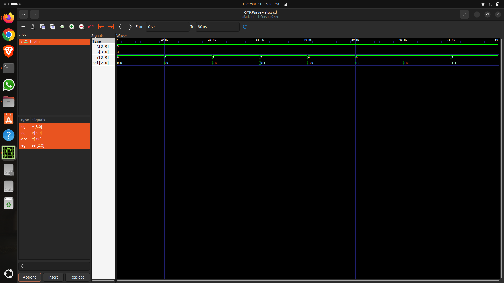

# 🔥 4-bit ALU Design using Verilog

## 📌 Description

This project implements a 4-bit Arithmetic Logic Unit (ALU) using Verilog HDL.
It performs both arithmetic and logical operations based on a select signal.

---

## 🔌 Inputs & Outputs

| Signal | Description      |
| ------ | ---------------- |
| A      | 4-bit input      |
| B      | 4-bit input      |
| sel    | Operation select |
| result | 4-bit output     |

---

## ⚙️ Operations Supported

| sel | Operation   |
| --- | ----------- |
| 000 | Addition    |
| 001 | Subtraction |
| 010 | AND         |
| 011 | OR          |
| 100 | XOR         |
| 101 | NOT         |
| 110 | Shift Left  |
| 111 | Shift Right |

---

## 🧠 Working

The ALU takes two 4-bit inputs (`A` and `B`) and performs the selected operation
based on the control signal `sel`. The result is generated accordingly.

---

## 📁 Project Structure

* `alu.v` → ALU design module
* `tb_alu.v` → Testbench
* `alu.vcd` → Simulation waveform file
* `waveform.png` → Output waveform image

---

## ▶️ Simulation

### Run the code:

```bash
iverilog tb_alu.v alu.v -o out
vvp out
gtkwave alu.vcd
```

---

## 📊 Waveform Output



---
